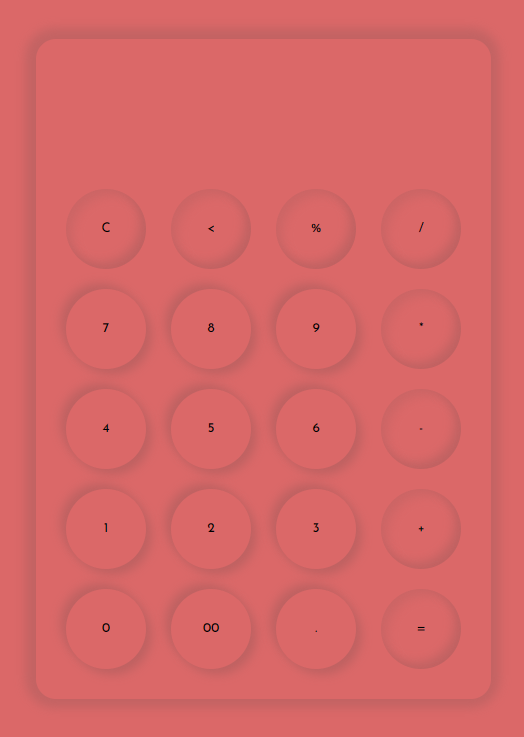

# Calculator

A simple, user-friendly calculator web application built using JavaScript, HTML, and CSS. This project demonstrates the basic functionality of a calculator, along with a clean and responsive design.

# Features
* Clean and intuitive user interface
* Basic arithmetic operations (addition, subtraction, multiplication, division)
* Responsive design for mobile and desktop
* Clear button to reset the calculator
* Error handling for invalid operations

# Technologies Used
* **JavaScript**: Implements the core calculator logic and handles user interactions
* **HTML**: Provides the structure of the web application
* **CSS**: Styles the application for a better user experience

# How It Works
* The calculator interface is presented to the user with a display screen and buttons for digits (0-9) and operations (+, -, *, /).
* Users can click on the buttons to input numbers and operations, which are displayed on the screen.
* The calculator processes the input and displays the result when the equals (=) button is pressed.
* The clear (C) button resets the display and allows for a new calculation.

# Guidelines
## Setup
1. **Clone the repository**:
    ```bash
    https://github.com/hungrycarpet/JavaScript-HTML-CSS-Projects.git
    ```
2. **Navigate to the project directory**:
    ```bash
    cd Calculator
    ```
3. **Open `index.html` in your browser**:
    ```bash
    open index.html
    ```
    
## IDE used
* Visual Studio Code
  
## Project Structure
* `index.html`: Contains the HTML structure of the calculator.
* `style.css`: Contains the CSS styles for the calculator.
* `script.js`: Contains the JavaScript code for the calculator's functionality.

# Screenshots


# Contact
For any queries or feedback, please contact me at ***manasparasar@gmail.com***

# License
MIT License

Copyright (c) 2019 Manas Mishra

Permission is hereby granted, free of charge, to any person obtaining a copy
of this software and associated documentation files (the "Software"), to deal
in the Software without restriction, including without limitation the rights
to use, copy, modify, merge, publish, distribute, sublicense, and/or sell
copies of the Software, and to permit persons to whom the Software is
furnished to do so, subject to the following conditions:

The above copyright notice and this permission notice shall be included in all
copies or substantial portions of the Software.

THE SOFTWARE IS PROVIDED "AS IS", WITHOUT WARRANTY OF ANY KIND, EXPRESS OR
IMPLIED, INCLUDING BUT NOT LIMITED TO THE WARRANTIES OF MERCHANTABILITY,
FITNESS FOR A PARTICULAR PURPOSE AND NONINFRINGEMENT. IN NO EVENT SHALL THE
AUTHORS OR COPYRIGHT HOLDERS BE LIABLE FOR ANY CLAIM, DAMAGES OR OTHER
LIABILITY, WHETHER IN AN ACTION OF CONTRACT, TORT OR OTHERWISE, ARISING FROM,
OUT OF OR IN CONNECTION WITH THE SOFTWARE OR THE USE OR OTHER DEALINGS IN THE
SOFTWARE.
