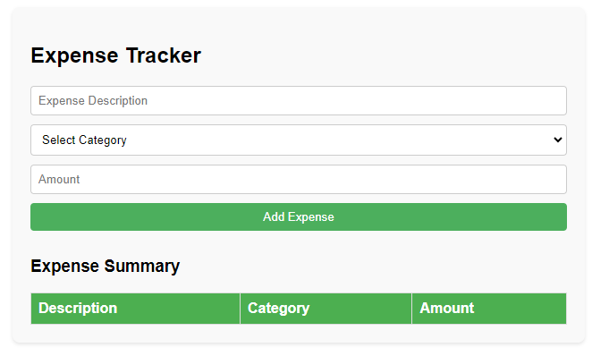

# Expense Tracker

The Expense Tracker is a sleek and user-friendly web application designed to help you manage your finances effortlessly. Built using the power of JavaScript, HTML, and CSS, this application provides an intuitive platform for recording, categorizing, and monitoring your expenses. Whether you're keeping track of daily expenditures or managing a budget, the Expense Tracker ensures that your financial data is organized and easily accessible.

# Features
* **Elegant User Interface**: Enjoy a clean and modern design that enhances user experience and makes financial tracking enjoyable.
* **Add Expenses**: Quickly add new expenses by providing a description, selecting a category, and entering the amount spent.
* **Categorize Expenses**: Organize your expenses into predefined or custom categories for better tracking and analysis.
* **Dynamic Expense List**: View your expenses in a beautifully styled, dynamically updating list that displays all relevant details at a glance.
* **Delete Functionality**: Easily remove any expense from the list with a single click, keeping your records tidy and up-to-date.
* **Responsive Design**: The application is fully responsive, ensuring a seamless experience on both mobile devices and desktop computers.
* **Error Handling**: Robust error handling ensures that all inputs are validated, providing a smooth and error-free experience.

# Technologies Used
* **JavaScript**: The core logic of the application is implemented using JavaScript, handling all user interactions and dynamic updates.
* **HTML**: The structure of the web application is built using HTML, providing a solid foundation for the user interface.
* **CSS**: The application is styled with CSS, offering an aesthetically pleasing and responsive design that adapts to various screen sizes.

# How It Works
1. **User Interface**:
    * The main interface presents a form for entering expense details, including description, category, and amount.
    * Below the form, a dynamic list displays all recorded expenses with their respective details.

2. **Adding an Expense**:
    * Enter the expense description, choose a category, and specify the amount.
    * Click the "Add Expense" button to record the expense.
    * The new expense is instantly added to the list, and the input fields are cleared for the next entry.

3. **Viewing Expenses**:
    * All recorded expenses are displayed in a list format, showing the description, category, and amount.
    * The list is dynamically updated with each new entry or deletion, ensuring the latest information is always visible.

4. **Deleting an Expense**:
    * Each expense in the list includes a delete button.
    * Click the delete button next to an expense to remove it from the list.
    * The list updates immediately, reflecting the removal of the expense.

# Guidelines
## Setup
1. **Clone the Repository**:
    ```bash
    https://github.com/hungrycarpet/JavaScript-HTML-CSS-Projects.git
    ```
2. **Navigate to the Project Directory**:
    ```bash
    cd Expense-Tracker
    ```
3. **Open `index.html` in Your Browser**:
    ```bash
    open index.html
    ```

## Project Structure
* `index.html`: Contains the entire application, including HTML structure, embedded CSS for styling, and embedded JavaScript for functionality.

# Screenshots


# Contact
For any queries or feedback, please contact me at ***your.email@example.com***

# License
MIT License


