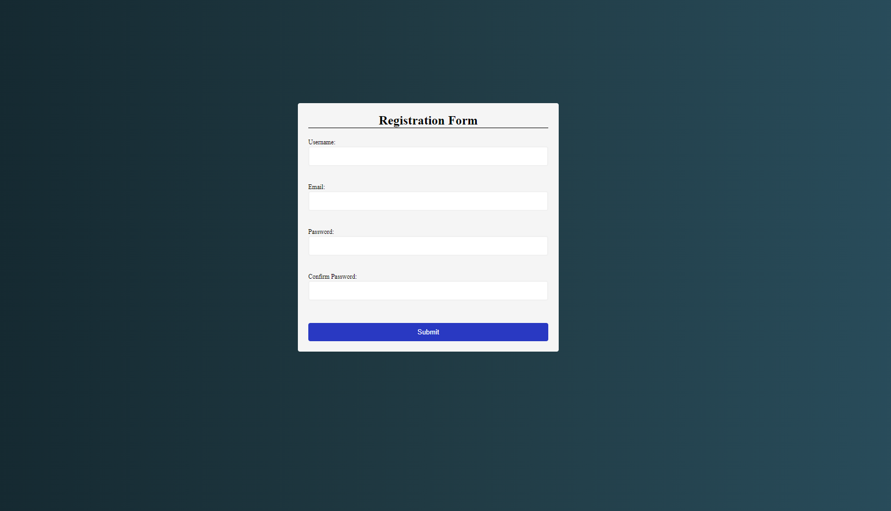

# Form Validation

The Form Validation application is a sleek and efficient web tool designed to ensure that user input is accurate and meets specified criteria. Built using JavaScript, HTML, and CSS, this application features a robust sign-up form that validates user entries in real-time. Whether you're developing a registration page for a website or a user authentication system, this Form Validation application demonstrates essential techniques for enhancing user experience and data integrity.

# Features
* **Elegant User Interface**: Enjoy a clean and modern design that enhances user experience and ensures that form validation is intuitive and visually appealing.
* **Real-time Validation**: Validate user input as it is entered, providing immediate feedback to ensure data accuracy and completeness.
* **Field-Specific Validation**: Check the validity of each entry, including username, email, password, and confirm password fields.
* **Visual Feedback**: Highlight invalid entries with a red border and valid entries with a green border, making it easy for users to identify and correct errors.
* **Comprehensive Error Handling**: Implement robust error handling to catch and display validation errors effectively.
* **Responsive Design**: The application is fully responsive, ensuring a seamless experience on both mobile devices and desktop computers.

# Technologies Used
* **JavaScript**: Implements the core validation logic, handling user input and providing real-time feedback.
* **HTML**: Provides the structure of the web application, including the sign-up form elements.
* **CSS**: Styles the application, offering an aesthetically pleasing and responsive design that adapts to various screen sizes.

# How It Works
1. **User Interface**:
    * The main interface presents a sign-up form with fields for username, email, password, and confirm password.
    * Each field is designed to provide visual feedback based on the validity of the input.

2. **Entering User Information**:
    * Users input their username, email address, password, and confirm password.
    * As each field is filled out, JavaScript functions validate the input against predefined criteria.

3. **Validation Criteria**:
    * **Username**: Checks if the field is not empty and meets any additional length or character requirements.
    * **Email**: Validates the email format to ensure it follows standard email conventions.
    * **Password**: Ensures the password meets the required complexity, such as length and character types.
    * **Confirm Password**: Verifies that the confirm password field matches the password field.

4. **Visual Feedback**:
    * Valid entries are highlighted with a green border, indicating that the input meets the requirements.
    * Invalid entries are highlighted with a red border, signaling that the user needs to correct the input.

# Guidelines
## Setup
1. **Clone the Repository**:
    ```bash
    git clone https://github.com/hungrycarpet/JavaScript-HTML-CSS-Projects.git
    ```
2. **Navigate to the Project Directory**:
    ```bash
    cd Form-Validation
    ```
3. **Open `index.html` in Your Browser**:
    ```bash
    open index.html
    ```

## Project Structure
* `index.html`: Contains the HTML structure of the sign-up form.
* `style.css`: Contains the CSS styles for the form and visual feedback.
* `script.js`: Contains the JavaScript code for form validation logic.

# Screenshots


# Contact
For any queries or feedback, please contact me at ***manasparasar@gmail.com***

# License
MIT License

Copyright (c) 2019 Manas Mishra

Permission is hereby granted, free of charge, to any person obtaining a copy
of this software and associated documentation files (the "Software"), to deal
in the Software without restriction, including without limitation the rights
to use, copy, modify, merge, publish, distribute, sublicense, and/or sell
copies of the Software, and to permit persons to whom the Software is
furnished to do so, subject to the following conditions:

The above copyright notice and this permission notice shall be included in all
copies or substantial portions of the Software.

THE SOFTWARE IS PROVIDED "AS IS", WITHOUT WARRANTY OF ANY KIND, EXPRESS OR
IMPLIED, INCLUDING BUT NOT LIMITED TO THE WARRANTIES OF MERCHANTABILITY,
FITNESS FOR A PARTICULAR PURPOSE AND NONINFRINGEMENT. IN NO EVENT SHALL THE
AUTHORS OR COPYRIGHT HOLDERS BE LIABLE FOR ANY CLAIM, DAMAGES OR OTHER
LIABILITY, WHETHER IN AN ACTION OF CONTRACT, TORT OR OTHERWISE, ARISING FROM,
OUT OF OR IN CONNECTION WITH THE SOFTWARE OR THE USE OR OTHER DEALINGS IN THE
SOFTWARE.
