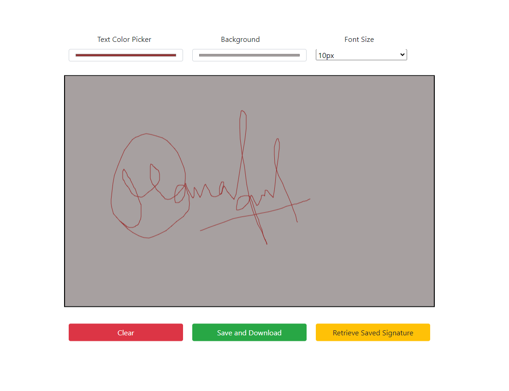

# Quick Signature

The Quick Signature application is an elegant and user-friendly web tool designed to help you create and save your digital signatures effortlessly. Built using JavaScript, HTML, and CSS, this application provides a seamless platform for generating high-quality signatures. Whether you need a signature for documents, emails, or any other digital medium, Quick Signature ensures that you can create, customize, and save your signatures with ease.

# Features
* **Beautiful User Interface**: Enjoy a clean and modern design that enhances user experience and makes signature creation enjoyable.
* **Customizable Pen and Canvas**: Set the color of the pen and canvas to match your preferences and achieve the perfect look for your signature.
* **Adjustable Pen Size**: Modify the size of the pen to suit your style and create a signature that feels just right.
* **Download Signature**: Save your signature in PNG format with a single click, making it easy to use your signature across various platforms.
* **Load Last Saved Signature**: Bring back your last saved copy of the signature for further modifications or completion if anything is pending.
* **Responsive Design**: The application is fully responsive, ensuring a seamless experience on both mobile devices and desktop computers.

# Technologies Used
* **JavaScript**: Implements the core functionality, including drawing on the canvas, customizing settings, and handling user interactions.
* **HTML**: Provides the structure of the web application, including the signature canvas and control elements.
* **CSS**: Styles the application, offering an aesthetically pleasing and responsive design that adapts to various screen sizes.

# How It Works
1. **User Interface**:
    * The main interface presents a canvas for drawing your signature, along with controls for customizing pen color, pen size, and canvas color.
    * Buttons are provided to clear the canvas, save the signature, and load the last saved signature.

2. **Creating a Signature**:
    * Select the desired pen color and size using the provided controls.
    * Use the canvas area to draw your signature.
    * Adjust the canvas color if needed to enhance visibility or match your preferences.

3. **Saving and Loading Signatures**:
    * Click the "Save Signature" button to download your signature in PNG format.
    * Use the "Load Last Signature" button to retrieve your last saved signature for further modifications or to complete any pending work.

4. **Customizing the Experience**:
    * Change the pen color and size to refine your signature.
    * Modify the canvas color to ensure your signature stands out.

# Guidelines
## Setup
1. **Clone the Repository**:
    ```bash
    git clone https://github.com/hungrycarpet/JavaScript-HTML-CSS-Projects.git
    ```
2. **Navigate to the Project Directory**:
    ```bash
    cd Quick-Signature
    ```
3. **Open `index.html` in Your Browser**:
    ```bash
    open index.html
    ```

## Project Structure
* `index.html`: Contains the HTML structure of the application, including the signature canvas and control elements.
* `style.css`: Contains the CSS styles for the application, ensuring a visually appealing and responsive design.
* `script.js`: Contains the JavaScript code for the application's functionality, including drawing, saving, and loading signatures.

# Screenshots


# Contact
For any queries or feedback, please contact me at ***manasparasar@gmail.com***

# License
MIT License

Copyright (c) 2019 Manas Mishra

Permission is hereby granted, free of charge, to any person obtaining a copy
of this software and associated documentation files (the "Software"), to deal
in the Software without restriction, including without limitation the rights
to use, copy, modify, merge, publish, distribute, sublicense, and/or sell
copies of the Software, and to permit persons to whom the Software is
furnished to do so, subject to the following conditions:

The above copyright notice and this permission notice shall be included in all
copies or substantial portions of the Software.

THE SOFTWARE IS PROVIDED "AS IS", WITHOUT WARRANTY OF ANY KIND, EXPRESS OR
IMPLIED, INCLUDING BUT NOT LIMITED TO THE WARRANTIES OF MERCHANTABILITY,
FITNESS FOR A PARTICULAR PURPOSE AND NONINFRINGEMENT. IN NO EVENT SHALL THE
AUTHORS OR COPYRIGHT HOLDERS BE LIABLE FOR ANY CLAIM, DAMAGES OR OTHER
LIABILITY, WHETHER IN AN ACTION OF CONTRACT, TORT OR OTHERWISE, ARISING FROM,
OUT OF OR IN CONNECTION WITH THE SOFTWARE OR THE USE OR OTHER DEALINGS IN THE
SOFTWARE
