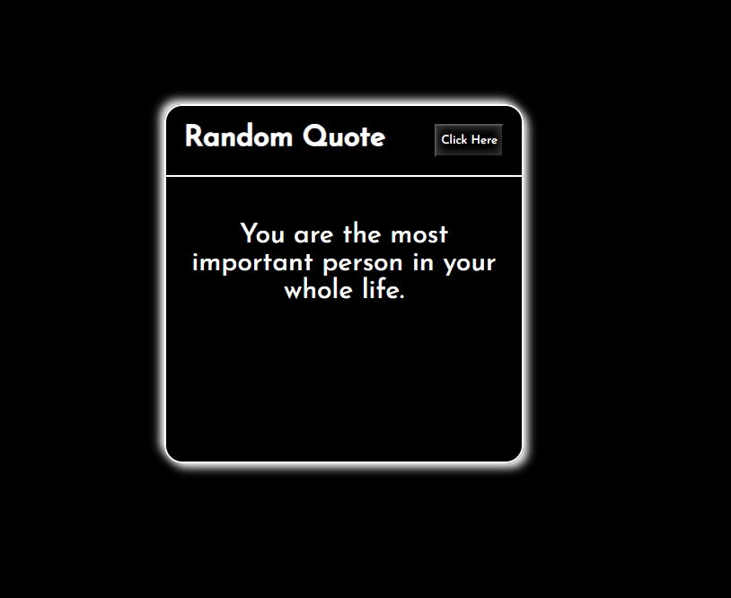

# Random Quotes

The Random Quotes application is an elegant and user-friendly web tool designed to provide you with inspiring and thought-provoking quotes at the click of a button. Built using JavaScript, HTML, and CSS, this application features a sleek and modern interface that makes discovering new quotes a delightful experience. Whether you're seeking motivation, wisdom, or just a moment of reflection, the Random Quotes application has something for everyone.

# Features
* **Beautiful User Interface**: Enjoy a clean and modern design that enhances user experience and makes exploring quotes enjoyable.
* **Random Quote Generation**: Get a new random quote with each click of the button, ensuring a fresh and diverse selection of quotes.
* **Responsive Design**: The application is fully responsive, ensuring a seamless experience on both mobile devices and desktop computers.
* **Smooth Transitions**: Experience smooth transitions between quotes, providing a pleasant and engaging user experience.
* **Error Handling**: Robust error handling ensures that the application runs smoothly, providing a seamless experience even if issues arise.

# Technologies Used
* **JavaScript**: Implements the core functionality, handling the random generation and display of quotes.
* **HTML**: Provides the structure of the web application, including the quote display area and button.
* **CSS**: Styles the application, offering an aesthetically pleasing and responsive design that adapts to various screen sizes.

# How It Works
1. **User Interface**:
    * The main interface presents a display area for the quote and a button to generate a new random quote.
    * Quotes are displayed in a visually appealing format, with smooth transitions enhancing the user experience.

2. **Generating a Random Quote**:
    * Click the "Click-Here" button to fetch a new random quote.
    * The displayed quote updates instantly, providing a fresh and inspiring message.

3. **Responsive Design**:
    * The application layout adjusts seamlessly to different screen sizes, ensuring a great user experience on both mobile and desktop devices.

4. **Error Handling**:
    * Robust error handling ensures that any issues with fetching or displaying quotes are managed gracefully, maintaining a smooth user experience.

# Guidelines
## Setup
1. **Clone the Repository**:
    ```bash
    git clone https://github.com/hungrycarpet/JavaScript-HTML-CSS-Projects.git
    ```
2. **Navigate to the Project Directory**:
    ```bash
    cd Random-Quotes
    ```
3. **Open `index.html` in Your Browser**:
    ```bash
    open index.html
    ```

## Project Structure
* `index.html`: Contains the HTML structure of the application, including the quote display area and button.
* `index.css`: Contains the CSS styles for the application, ensuring a visually appealing and responsive design.
* `index.js`: Contains the JavaScript code for generating and displaying random quotes.

# Screenshots


# Contact
For any queries or feedback, please contact me at ***manasparasar@gmail.com***

# License
MIT License

