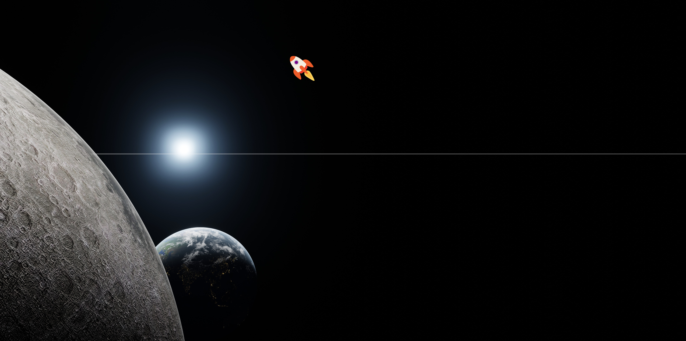

# Rocket Moving with a Mouse

The Rocket Moving with a Mouse application is a captivating and interactive web tool designed for space enthusiasts and those who love playful animations. Built using JavaScript, HTML, and CSS, this application features a sleek and engaging interface where users can control the movement of a rocket by simply hovering their mouse over a canvas that depicts outer space. This fun and educational tool is perfect for anyone looking to explore the wonders of space in a creative and interactive way.

# Features
* **Beautiful User Interface**: Enjoy a clean and modern design that enhances user experience and makes interacting with the rocket enjoyable.
* **Interactive Rocket Movement**: Control the rocket's movement with your mouse, making it hover across the canvas with smooth and responsive animations.
* **Space-Themed Background**: Immerse yourself in a space-themed environment with a visually appealing background that adds to the overall experience.
* **Responsive Design**: The application is fully responsive, ensuring a seamless experience on both mobile devices and desktop computers.
* **Smooth Animations**: Experience smooth and fluid animations that make the rocket's movement realistic and engaging.
* **Error Handling**: Robust error handling ensures that the application runs smoothly, providing a seamless experience even if issues arise.

# Technologies Used
* **JavaScript**: Implements the core functionality, handling the rocket's movement and user interactions.
* **HTML**: Provides the structure of the web application, including the canvas and control elements.
* **CSS**: Styles the application, offering an aesthetically pleasing and responsive design that adapts to various screen sizes.

# How It Works
1. **User Interface**:
    * The main interface presents a canvas depicting outer space and a rocket that users can control with their mouse.
    * The canvas is styled to create an immersive space-themed environment.

2. **Controlling the Rocket**:
    * Move your mouse over the canvas to control the rocket's movement.
    * The rocket follows the mouse pointer smoothly, providing a responsive and interactive experience.

3. **Responsive Design**:
    * The application layout adjusts seamlessly to different screen sizes, ensuring a great user experience on both mobile and desktop devices.

4. **Error Handling**:
    * Robust error handling ensures that any issues with the rocket's movement or canvas interactions are managed gracefully, maintaining a smooth user experience.

# Guidelines
## Setup
1. **Clone the Repository**:
    ```bash
    git clone https://github.com/hungrycarpet/JavaScript-HTML-CSS-Projects.git
    ```
2. **Navigate to the Project Directory**:
    ```bash
    cd Rocket-Moving-With-Mouse
    ```
3. **Open `index.html` in Your Browser**:
    ```bash
    open index.html
    ```

## Project Structure
* `index.html`: Contains the HTML structure of the application, including the canvas and control elements.
* `style.css`: Contains the CSS styles for the application, ensuring a visually appealing and responsive design.
* `script.js`: Contains the JavaScript code for controlling the rocket's movement and handling user interactions.

# Screenshots


# Contact
For any queries or feedback, please contact me at ***manasparasar@gmail.com***

# License
MIT License

Copyright (c) 2019 Manas Mishra

Permission is hereby granted, free of charge, to any person obtaining a copy
of this software and associated documentation files (the "Software"), to deal
in the Software without restriction, including without limitation the rights
to use, copy, modify, merge, publish, distribute, sublicense, and/or sell
copies of the Software, and to permit persons to whom the Software is
furnished to do so, subject to the following conditions:

The above copyright notice and this permission notice shall be included in all
copies or substantial portions of the Software.

THE SOFTWARE IS PROVIDED "AS IS", WITHOUT WARRANTY OF ANY KIND, EXPRESS OR
IMPLIED, INCLUDING BUT NOT LIMITED TO THE WARRANTIES OF MERCHANTABILITY,
FITNESS FOR A PARTICULAR PURPOSE AND NONINFRINGEMENT. IN NO EVENT SHALL THE
AUTHORS OR COPYRIGHT HOLDERS BE LIABLE FOR ANY CLAIM, DAMAGES OR OTHER
LIABILITY, WHETHER IN AN ACTION OF CONTRACT, TORT OR OTHERWISE, ARISING FROM,
OUT OF OR IN CONNECTION WITH THE SOFTWARE OR THE USE OR OTHER DEALINGS IN THE
SOFTWARE.
