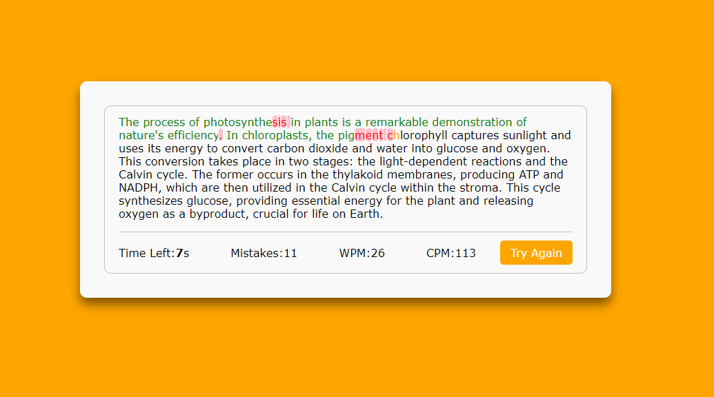

# Typing Speed Test

The Typing Speed Test is an engaging and interactive web application designed to help users assess and improve their typing skills. Built using JavaScript, HTML, and CSS, this application features a sleek and modern interface that generates random and challenging prompts to create a competitive typing experience. With comprehensive metrics and real-time feedback, users can track their performance and strive to enhance their typing speed and accuracy.

# Features
* **Beautiful User Interface**: Enjoy a clean and modern design that enhances user experience and makes the typing test enjoyable.
* **Random Prompts**: Generate random and challenging prompts to ensure a fair and competitive typing test.
* **Real-Time Feedback**: Receive instant feedback on your typing, with correct characters highlighted in green, mistakes highlighted in red, and the next character to type marked in yellow.
* **Comprehensive Metrics**: View detailed metrics such as words per minute (WPM), characters per minute (CPM), and the number of mistakes made.
* **Digital Stopwatch**: A 60-second timer is displayed prominently, allowing users to track their time as they type.
* **Responsive Design**: The application is fully responsive, ensuring a seamless experience on both mobile devices and desktop computers.
* **Error Handling**: Robust error handling ensures that the application runs smoothly, providing a seamless experience even if issues arise.

# Technologies Used
* **JavaScript**: Implements the core functionality, handling prompt generation, real-time feedback, and performance metrics.
* **HTML**: Provides the structure of the web application, including the typing area, timer, and metrics display.
* **CSS**: Styles the application, offering an aesthetically pleasing and responsive design that adapts to various screen sizes.

# How It Works
1. **User Interface**:
    * The main interface presents a text area for typing, a digital stopwatch, and a display area for metrics.
    * The next character to type is highlighted in yellow, correct characters are marked in green, and mistakes are highlighted in red.

2. **Starting the Test**:
    * Click the "Start Test" button to generate a random typing prompt and begin the 60-second timer.
    * The prompt appears in the text area, and the timer starts counting down from 60 seconds.

3. **Typing the Prompt**:
    * Type the characters as they appear in the prompt.
    * Receive real-time feedback with visual indicators for correct and incorrect characters.

4. **Viewing Metrics**:
    * After 60 seconds, the test ends, and detailed metrics are displayed, including words per minute (WPM), characters per minute (CPM), and the number of mistakes made.

# Guidelines
## Setup
1. **Clone the Repository**:
    ```bash
    git clone https://github.com/hungrycarpet/JavaScript-HTML-CSS-Projects.git
    ```
2. **Navigate to the Project Directory**:
    ```bash
    cd Typing-Speed-Test
    ```
3. **Open `index.html` in Your Browser**:
    ```bash
    open index.html
    ```

## Project Structure
* `index.html`: Contains the HTML structure of the application, including the typing area, timer, and metrics display.
* `style.css`: Contains the CSS styles for the application, ensuring a visually appealing and responsive design.
* `script.js`: Contains the JavaScript code for generating prompts, handling user input, and calculating performance metrics.

# Screenshots


# Contact
For any queries or feedback, please contact me at ***manasparasar@gmail.com***

# License
MIT License

Copyright (c) 2019 Manas Mishra

Permission is hereby granted, free of charge, to any person obtaining a copy
of this software and associated documentation files (the "Software"), to deal
in the Software without restriction, including without limitation the rights
to use, copy, modify, merge, publish, distribute, sublicense, and/or sell
copies of the Software, and to permit persons to whom the Software is
furnished to do so, subject to the following conditions:

The above copyright notice and this permission notice shall be included in all
copies or substantial portions of the Software.

THE SOFTWARE IS PROVIDED "AS IS", WITHOUT WARRANTY OF ANY KIND, EXPRESS OR
IMPLIED, INCLUDING BUT NOT LIMITED TO THE WARRANTIES OF MERCHANTABILITY,
FITNESS FOR A PARTICULAR PURPOSE AND NONINFRINGEMENT. IN NO EVENT SHALL THE
AUTHORS OR COPYRIGHT HOLDERS BE LIABLE FOR ANY CLAIM, DAMAGES OR OTHER
LIABILITY, WHETHER IN AN ACTION OF CONTRACT, TORT OR OTHERWISE, ARISING FROM,
OUT OF OR IN CONNECTION WITH THE SOFTWARE OR THE USE OR OTHER DEALINGS IN THE
SOFTWARE.
