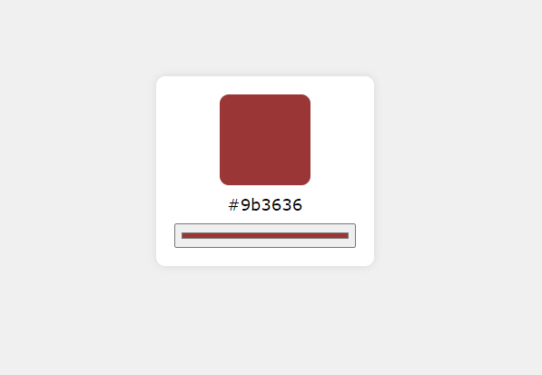

# Hex Code Picker

The Hex Code Picker is a sleek and user-friendly web application designed to help developers effortlessly obtain the hex code for any chosen color. Built using the power of JavaScript, HTML, and CSS, this application provides an intuitive platform for selecting colors and instantly displaying their corresponding hex codes. Whether you're a web developer, designer, or just someone who loves colors, the Hex Code Picker ensures that you can easily find and use the perfect color for your projects.

# Features
* **Elegant User Interface**: Enjoy a clean and modern design that enhances user experience and makes color picking enjoyable.
* **Color Picker**: Use a simple and interactive color picker to choose any color.
* **Hex Code Display**: Instantly view the hex code corresponding to the selected color.
* **Copy Functionality**: Easily copy the hex code to your clipboard with a single click for seamless integration into your projects.
* **Responsive Design**: The application is fully responsive, ensuring a seamless experience on both mobile devices and desktop computers.
* **Error Handling**: Robust error handling ensures that the application runs smoothly, providing a smooth and error-free experience.

# Technologies Used
* **JavaScript**: Implements the core logic of the application, handling user interactions and dynamically updating the hex code display.
* **HTML**: The structure of the web application is built using HTML, providing a solid foundation for the user interface.
* **CSS**: The application is styled with CSS, offering an aesthetically pleasing and responsive design that adapts to various screen sizes.

# How It Works
1. **User Interface**:
    * The main interface presents a color picker and an area to display the corresponding hex code.
    * A button is provided to copy the hex code to the clipboard.

2. **Selecting a Color**:
    * Use the color picker to select any desired color.
    * The hex code for the selected color is instantly displayed in the designated area.

3. **Copying the Hex Code**:
    * Click the "Copy" button to copy the hex code to your clipboard.
    * Use the copied hex code in your projects for seamless color integration.

4. **Responsive Design**:
    * The application layout adjusts seamlessly to different screen sizes, ensuring a great user experience on both mobile and desktop devices.

5. **Error Handling**:
    * Robust error handling ensures that any issues with color selection or hex code display are managed gracefully, maintaining a smooth user experience.

# Guidelines
## Setup
1. **Clone the Repository**:
    ```bash
    git clone https://github.com/hungrycarpet/JavaScript-HTML-CSS-Projects.git
    ```
2. **Navigate to the Project Directory**:
    ```bash
    cd Hex-Code-Picker
    ```
3. **Open `index.html` in Your Browser**:
    ```bash
    open index.html
    ```

## Project Structure
* `index.html`: Contains the HTML structure of the application, including the color picker and hex code display area.
* `style.css`: Contains the CSS styles for the application, ensuring a visually appealing and responsive design.
* `script.js`: Contains the JavaScript code for handling user interactions and dynamically updating the hex code display.

# Screenshots


# Contact
For any queries or feedback, please contact me at ***manasparasar@gmail.com***

# License
MIT License

Copyright (c) 2019 Manas Mishra

Permission is hereby granted, free of charge, to any person obtaining a copy
of this software and associated documentation files (the "Software"), to deal
in the Software without restriction, including without limitation the rights
to use, copy, modify, merge, publish, distribute, sublicense, and/or sell
copies of the Software, and to permit persons to whom the Software is
furnished to do so, subject to the following conditions:

The above copyright notice and this permission notice shall be included in all
copies or substantial portions of the Software.

THE SOFTWARE IS PROVIDED "AS IS", WITHOUT WARRANTY OF ANY KIND, EXPRESS OR
IMPLIED, INCLUDING BUT NOT LIMITED TO THE WARRANTIES OF MERCHANTABILITY,
FITNESS FOR A PARTICULAR PURPOSE AND NONINFRINGEMENT. IN NO EVENT SHALL THE
AUTHORS OR COPYRIGHT HOLDERS BE LIABLE FOR ANY CLAIM, DAMAGES OR OTHER
LIABILITY, WHETHER IN AN ACTION OF CONTRACT, TORT OR OTHERWISE, ARISING FROM,
OUT OF OR IN CONNECTION WITH THE SOFTWARE OR THE USE OR OTHER DEALINGS IN THE
SOFTWARE.
