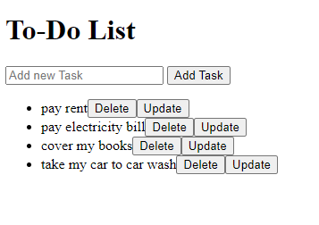

# To-Do Application

The To-Do application is a sleek and user-friendly web application designed to help you manage your tasks effortlessly. Built using the power of JavaScript, HTML, and CSS, this application provides an intuitive platform for listing, updating, and deleting your to-dos. Whether you're organizing your daily tasks or planning a project, the To-Do application ensures that your to-dos are easily accessible and manageable.

# Features
* **Elegant User Interface**: Enjoy a clean and modern design that enhances user experience and makes task management enjoyable.
* **Add To-Dos**: Quickly add new to-dos by providing a description of the task.
* **Update To-Dos**: Easily update existing to-dos to reflect changes or new information.
* **Delete Functionality**: Remove completed or unnecessary to-dos from the list with a single click, keeping your task list tidy and up-to-date.
* **Interactive Experience**: Interact with your to-dos seamlessly, with dedicated buttons for adding, updating, and deleting tasks.
* **Responsive Design**: The application is fully responsive, ensuring a seamless experience on both mobile devices and desktop computers.
* **Error Handling**: Robust error handling ensures that all inputs are validated, providing a smooth and error-free experience.

# Technologies Used
* **JavaScript**: The core logic of the application is implemented using JavaScript, handling all user interactions and dynamic updates.
* **HTML**: The structure of the web application is built using HTML, providing a solid foundation for the user interface.
* **CSS**: The application is styled with CSS, offering an aesthetically pleasing and responsive design that adapts to various screen sizes.

# How It Works
1. **User Interface**:
    * The main interface presents a form for entering to-do details, including the task description.
    * Below the form, a dynamic list displays all recorded to-dos with their respective details.

2. **Adding a To-Do**:
    * Enter the task description in the provided input field.
    * Click the "Add To-Do" button to record the task.
    * The new to-do is instantly added to the list, and the input field is cleared for the next entry.

3. **Updating a To-Do**:
    * Click the "Edit" button next to the to-do you want to update.
    * Modify the task description as needed.
    * Save the changes to update the to-do in the list.

4. **Deleting a To-Do**:
    * Each to-do in the list includes a delete button.
    * Click the delete button next to a to-do to remove it from the list.
    * The list updates immediately, reflecting the removal of the to-do.

# Guidelines
## Setup
1. **Clone the Repository**:
    ```bash
    git clone https://github.com/hungrycarpet/JavaScript-HTML-CSS-Projects.git
    ```
2. **Navigate to the Project Directory**:
    ```bash
    cd To-Do-Application
    ```
3. **Open `index.html` in Your Browser**:
    ```bash
    open index.html
    ```

## Project Structure
* `index.html`: Contains the entire application, including HTML structure, embedded CSS for styling, and embedded JavaScript for functionality.

# Screenshots


# Contact
For any queries or feedback, please contact me at ***manasparasar@gmail.com***

# License
MIT License

Copyright (c) 2019 Manas Mishra

Permission is hereby granted, free of charge, to any person obtaining a copy
of this software and associated documentation files (the "Software"), to deal
in the Software without restriction, including without limitation the rights
to use, copy, modify, merge, publish, distribute, sublicense, and/or sell
copies of the Software, and to permit persons to whom the Software is
furnished to do so, subject to the following conditions:

The above copyright notice and this permission notice shall be included in all
copies or substantial portions of the Software.

THE SOFTWARE IS PROVIDED "AS IS", WITHOUT WARRANTY OF ANY KIND, EXPRESS OR
IMPLIED, INCLUDING BUT NOT LIMITED TO THE WARRANTIES OF MERCHANTABILITY,
FITNESS FOR A PARTICULAR PURPOSE AND NONINFRINGEMENT. IN NO EVENT SHALL THE
AUTHORS OR COPYRIGHT HOLDERS BE LIABLE FOR ANY CLAIM, DAMAGES OR OTHER
LIABILITY, WHETHER IN AN ACTION OF CONTRACT, TORT OR OTHERWISE, ARISING FROM,
OUT OF OR IN CONNECTION WITH THE SOFTWARE OR THE USE OR OTHER DEALINGS IN THE
SOFTWARE.
